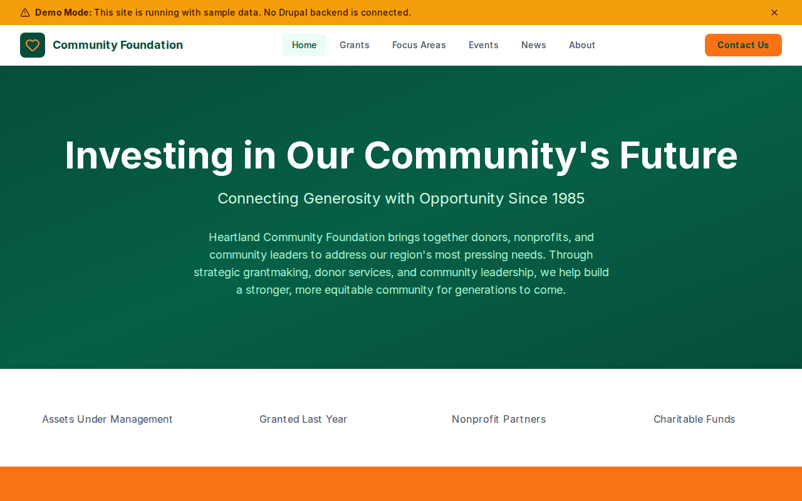

# Decoupled Community Foundation

A community foundation website starter template for Decoupled Drupal + Next.js. Built for philanthropic foundations, grant-making organizations, and donor-advised fund providers.



## Features

- **Grant Opportunities** - Community impact grants, capacity building, and scholarships with deadlines, eligibility, and application links
- **Focus Areas** - Strategic investment priorities (Education, Health, Arts, Economic Development) with outcomes and investment totals
- **Foundation Events** - Galas, nonprofit summits, giving days, and community forums with registration and ticketing
- **Foundation News** - Grant announcements, donor spotlights, annual reports, and press releases
- **Modern Design** - Clean, accessible UI optimized for foundation and nonprofit content

## Quick Start

### 1. Clone the template

```bash
npx degit nextagencyio/decoupled-community-foundation my-foundation
cd my-foundation
npm install
```

### 2. Run interactive setup

```bash
npm run setup
```

This interactive script will:
- Authenticate with Decoupled.io (opens browser)
- Create a new Drupal space
- Wait for provisioning (~90 seconds)
- Configure your `.env.local` file
- Import sample content

### 3. Start development

```bash
npm run dev
```

Visit [http://localhost:3000](http://localhost:3000)

---

## Manual Setup

<details>
<summary>Click to expand manual setup steps</summary>

### Authenticate with Decoupled.io

```bash
npx decoupled-cli@latest auth login
```

### Create a Drupal space

```bash
npx decoupled-cli@latest spaces create "My Community Foundation"
```

Note the space ID returned. Wait ~90 seconds for provisioning.

### Configure environment

```bash
npx decoupled-cli@latest spaces env 1234 --write .env.local
```

### Import content

```bash
npm run setup-content
```

This imports:
- Homepage with asset statistics and call to action
- 3 Grant Opportunities (Community Impact, Capacity Building, Scholarship)
- 3 Focus Areas (Education, Health & Wellness, Arts & Culture)
- 3 Foundation Events (Annual Gala, Nonprofit Summit, Giving Day)
- 3 News Articles (Annual Report, Grant Recipients, Donor Spotlight)
- 2 Static Pages (About, For Donors)

</details>

## Content Types

### Grant
- **Grant Type** - Community Grant, Capacity Building, Capital Project, Scholarship, Emergency Fund
- **Funding Amount** - Grant award range
- **Application Deadline** - When applications close
- **Eligibility Criteria** - Who can apply
- **Focus Areas** - Which strategic priorities the grant supports
- **Application URL** - Link to apply
- **Grant Image** - Photo representing the grant

### Focus Area
- **Icon Name** - Icon identifier for display
- **Total Investment** - Annual investment in this area
- **Grants Awarded** - Number of grants given
- **Key Outcomes** - Measurable impact results
- **Focus Area Image** - Photo representing the area

### Foundation Event
- **Event Date / End Date** - Event timing
- **Location** - Where the event takes place
- **Event Category** - Gala, Workshop, Community Forum, Networking, Award Ceremony
- **Registration URL** - Link to register
- **Ticket Price** - Cost to attend
- **Event Image** - Promotional photo

### News
- **News Category** - Grant Announcement, Foundation News, Community Impact, Donor Spotlight, Press Release
- **Publish Date** - When the article was published
- **Author** - Writer or department
- **Summary** - Brief excerpt
- **Featured Image** - Article image

## Customization

### Colors & Branding
Edit `tailwind.config.js` to customize colors, fonts, and spacing.

### Content Structure
Modify `data/community-foundation-content.json` to add or change content types and sample content.

### Components
React components are in `app/components/`. Update them to match your design needs.

## Demo Mode

Demo mode allows you to showcase the application without connecting to a Drupal backend.

### Enable Demo Mode

```bash
NEXT_PUBLIC_DEMO_MODE=true
```

### Removing Demo Mode

1. Delete `lib/demo-mode.ts`
2. Delete `data/mock/` directory
3. Delete `app/components/DemoModeBanner.tsx`
4. Remove `DemoModeBanner` from `app/layout.tsx`
5. Remove demo mode checks from `app/api/graphql/route.ts`

## Deployment

### Vercel (Recommended)
[](https://vercel.com/new/clone?repository-url=https://github.com/nextagencyio/decoupled-community-foundation)

### Other Platforms
Works with any Node.js hosting platform that supports Next.js.

## Documentation

- [Decoupled.io Docs](https://www.decoupled.io/docs)
- [Next.js Documentation](https://nextjs.org/docs)
- [Drupal GraphQL](https://www.decoupled.io/docs/graphql)

## License

MIT
